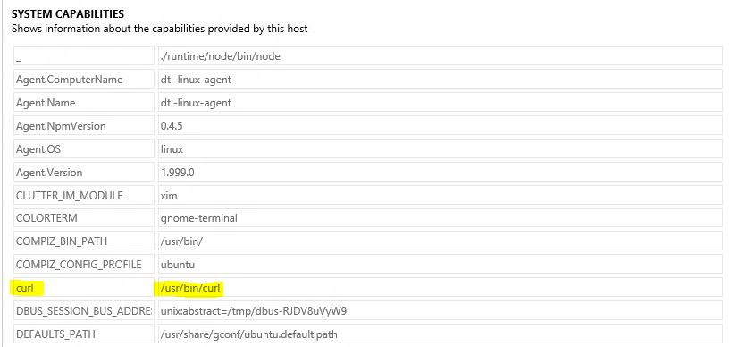
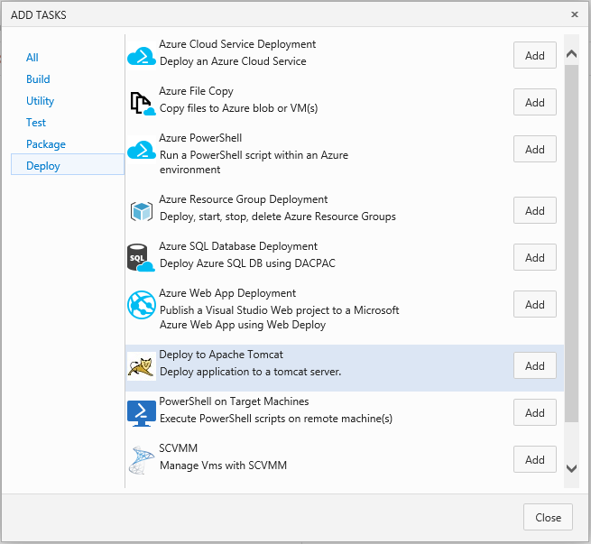
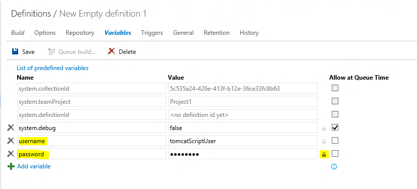

#Deploy web applications to Apache Tomcat server
Deploy your Java web applications to a tomcat server from Visual Studio Team Services or Team Foundation Server.
Currently the following features are available:
* Deploy/Re-deploy to Tomcat manager. Copies the war file to the target automatically.

This extension installs the following components
* Apache Tomcat Deployment task - A Build/Release task to deploy WAR files. [Learn more](https://github.com/Microsoft/vsts-tomcat/blob/master/src/tasks/tomcatDeployment/README.md)

##Usage
The deployment tasks use cURL.
1. Install cURL on Build/Release agent
2. Make sure cURL is reported as an agent capability

 
If not detected automatically, add manually

 
 

###Using Apache Tomcat Deployment task to deploy WAR files
1. Open your build or release definition and add the Apache Tomcat Deployment task. The task can be found in the **Deploy** section of the **Add Tasks** dialog.

 
2. Fill-in the task parameters as described below:
|  Parameter Name                       |  Description                                                                                                                                                                      |
|---------------------------------------|-----------------------------------------------------------------------------------------------------------------------------------------------------------------------------------|
|  Tomcat Server URL                    | The URL for the Tomcat Server e.g. http://localhost:8080 "/manager" will be appended to your Server URL to talk to the Tomcat manager.                        |
|  Tomcat Manager Username And Password | These should match the credentials set in conf/tomcat-users.xml when you configured Tomcat. The user should have "manager-script" role set.             |
|  Application Context                  | Specifies where the application should sit on the Tomcat server once deployed e.g. /Test                                                                                          |
|  WAR File                             | The absolute path to the WAR file. Use <a href="https://msdn.microsoft.com/en-us/Library/vs/alm/Build/scripts/variables">(Build Variables)</a> to fill in the path of the agent e.g. $(Agent.BuildDirectory)\$(Build.Repository.Name)\Demo.war  |
|  Tomcat Server Version                | Choose the appropriate Tomcat Server Version. Supports: Tomcat 6.x, 7.x and 8.x.                                                                       |
 
**Sample**:

 
3. Define the variables used in the task parameters       

 
##Compatibility
Supports Tomcat 6.x, 7.x and 8.x

##Contact Information
For further information or to resolve issues, contact RM_Customer_Queries at Microsoft dot com.

##Trademarks
"Apache Tomcat" and "Tomcat" are trademarks of the Apache Software Foundation.